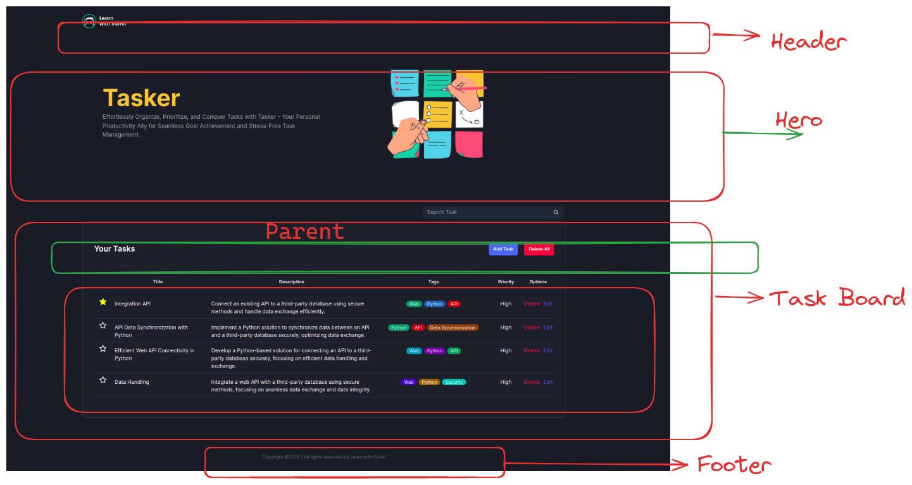

- `npm install`

- `npm run dev`



##

 আমি যখন `Edit button এ`  `click` করলাম, তখন `parent component` থেকে আসা `onEdit()` ফাংশনটি 
`props` হিসেবে`child component` এ  আসে এবং child component থেকে এই ফাংশনে একটি `আর্গুমেন্ট` হিসেবে `data` পাঠাই।

ja `parent component` e editHandleClick`(data)`  function e ace ebong parent component tar sathe ei data dite update kore

- **onClick={()=>onEdit(task)}** [here ,`onEdit` =props, `(task)`= data]

               

## Child to Parent data pass

- 1. `parent component` থেকে একটা `function`  `child component` e `props` হিসেবে পাঠাব।
- 2. সেই `ফাংশনটি`  বাটনের `onClick` এ কল করতে হবে। `child` er vitore
- 3. ফাংশনের `onClick` jokhon `কল` হলে সেই মুহূর্তে `ডাটা পাঠাবো।` `onClick={()=>callParentFunction(data)}`
- 4. এই ডাটার vittite `প্যারেন্ট কম্পোনেন্টের স্টেট আপডেট` করবো।

## Steps:
**Define the function in the parent component:[parentFunction]**

```javascript
import React, { useState } from 'react';

const ParentComponent = () => {
    const parentFunction = () => {
        console.log('Function in parent component called');
  };

  return (
      <ChildComponent callParentFunction={parentFunction} />
  );
};

```
**Pass the function as a prop to the child component::[{ callParentFunction }]**

```javascript
const ChildComponent = ({ callParentFunction }) => {
  return (
    <button onClick={callParentFunction}>
      Call Parent Function
    </button>
  );
};

```
**Call the function in the child component:**

```javascript
const ChildComponent = ({ callParentFunction }) => {
  return (
    <button onClick={callParentFunction}>
      Call Parent Function
    </button>
  );
};

```

##  If we want to pass object Child to ParentComponent

```javascript
import React from 'react';

const ParentComponent = () => {
  const parentFunction = () => {
    console.log('Function in parent component called');
  };

  const parentObject = {
    key1: 'value1',
    key2: 'value2',
  };

  return (
    <ChildComponent
      callParentFunction={parentFunction}
      parentObject={parentObject}
    />
  );
};

const ChildComponent = ({ callParentFunction, parentObject }) => {
  return (
    <div>
      <button onClick={callParentFunction}>
        Call Parent Function
      </button>
      <p>Parent Object: {JSON.stringify(parentObject)}</p>
    </div>
  );
};

export default ParentComponent;

``` 
